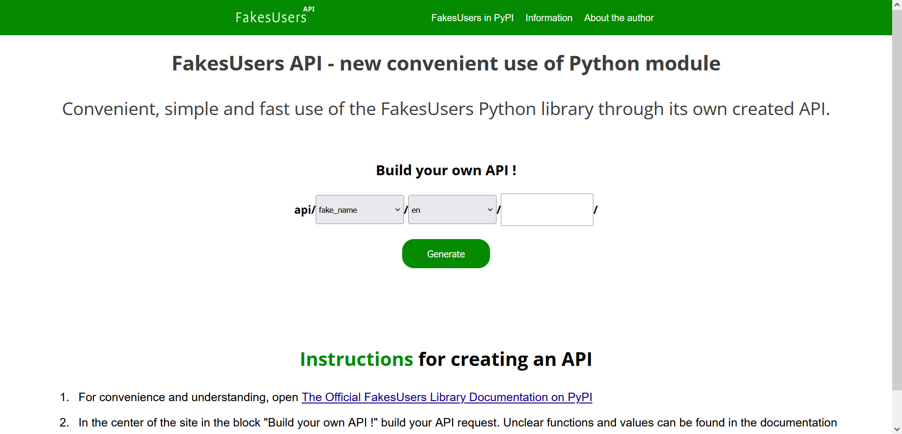

# FakesUsersAPI
FakesUsers API - it is an open source project. It is designed to generate random data through an API that runs on the FakesUsers Python library. The FakesUsers API project is made using the Django framework.
  

  

  

filcher project // 2024
